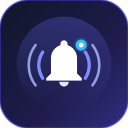
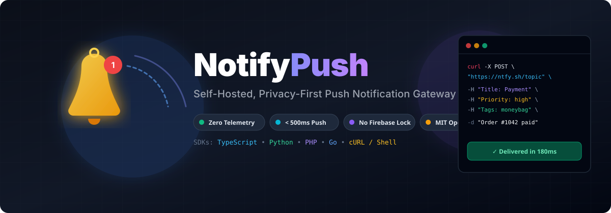

#  NotifyPush

<p align="center">
  
</p>

<p align="center">
  <b>The Lightweight, Privacy-First, Zero-Telemetry Push Notification Dispatcher &amp; Mobile Receiver</b>
</p>

<p align="center">
  <a href="https://www.npmjs.com/package/notifypush-client"></a>
  <a href="https://github.com/SudhirDevOps1/notify-push/releases"></a>
  <a href="https://github.com/SudhirDevOps1/notify-push/actions/workflows/ci.yml"></a>
  <a href="https://developer.android.com/"></a>
  <a href="LICENSE"></a>
  <a href="docs/README.hinglish.md"></a>
</p>

---

## 🌐 Language Guides / भाषा चुनें

- 🇬🇧 **[English Documentation (Default)](#-table-of-contents)**
- 🇮🇳 **[Hinglish संपूर्ण गाइड (हिंदी / English)](docs/README.hinglish.md)** — *Step-by-step saral bhasha me setup aur implementation guide.*

---

## 📑 Table of Contents

1. [Overview & Motivation](#-overview--motivation)
2. [Why, Where, When & In Which Projects to Use NotifyPush](#-why-where-when--in-which-projects-to-use-notifypush)
   - [Why (Kyu) Use NotifyPush?](#1-why-kyu-use-notifypush)
   - [Where (Kaha) Can You Integrate It?](#2-where-kaha-can-you-integrate-it)
   - [When (Kab) Should You Trigger Notifications?](#3-when-kab-should-you-trigger-notifications)
   - [Which Project Types?](#4-which-project-types-kis-types-ke-projects-me-use-karein)
   - [Multi-App Channels Manager](#5-️-multi-app-channels-manager-new-in-v101)
3. [Why NotifyPush vs. Firebase/FCM?](#-why-notifypush-vs-firebasefcm)
4. [Quick Start in 60 Seconds](#-quick-start-in-60-seconds)
5. [Universal SDK Toolkit](#-universal-sdk-toolkit)
   - [TypeScript / Node.js / Next.js](#1-typescript--nodejs--nextjs)
   - [Python (FastAPI, Django, Flask)](#2-python-fastapi-django-flask)
   - [PHP (Laravel, Core PHP)](#3-php-laravel-core-php)
   - [Go (Golang Microservices)](#4-go-golang-microservices)
   - [CLI & GitHub Actions](#5-cli--github-actions-workflow)
6. [Android Mobile App](#-android-mobile-app)
   - [Camera QR Code Scanner](#instant-qr-code-scanner)
   - [24/7 Resilient Daemon Service](#247-resilient-background-daemon)
   - [Battery Optimization Setup](#battery-optimization-setup)
7. [Desktop Application (Windows .exe)](#-desktop-application-windows-exe)
   - [Native Windows Toasts & Tray Daemon](#native-windows-toasts--tray-daemon)
   - [Standalone Portable .exe](#standalone-portable-exe)
8. [Self-Hosting with Docker](#-self-hosting-with-docker)
9. [Security & End-to-End Encryption](#-security--end-to-end-encryption)
10. [Documentation Index](#-documentation-index)
11. [Contributing & License](#-contributing--license)

---

---


---

## 💡 Why, Where, When & In Which Projects to Use NotifyPush

### 1. Why (Kyu) Use NotifyPush?

| Core Problem with Traditional Push | How NotifyPush Solves It |
|---|---|
| **Privacy & Telemetry Leaks**: Firebase/OneSignal log device IPs, user metadata, and message contents. | 🛡️ **Zero Telemetry**: No third-party data collection. Direct TLS stream to your phone. E2EE (AES-256-GCM) ready. |
| **Vendor Lock-in & Complexity**: Requires Google Cloud Console, `google-services.json`, SHA-1 fingerprints, and app store approvals. | ⚡ **Zero Setup Friction**: No accounts, no credentials. Pick a secret topic name and start receiving alerts in 60 seconds. |
| **Expensive Monthly Subscriptions**: Pusher, Twilio, and PagerDuty charge $50–$200+/month once volumes scale. | 🆓 **100% Free & Open Source**: Unlimited notifications via public gateways or your own private Docker container. |
| **High Latency & Queuing Delays**: Firebase can throttle background notifications by 5–30 seconds during power-saving modes. | 🚀 **Under 300ms Delivery**: Direct Server-Sent Events (SSE) stream delivers alerts straight to hardware foreground daemon. |
| **Single-App Chaos**: Mixing alerts from 5 different websites into one messy notification channel. | 🗂️ **Multi-App Channels Manager**: Register unlimited distinct apps (e.g. *Store Leads*, *Prod Server*, *Personal Blog*) on 1 phone & 1 desktop app with sender name tagging. |

---

### 2. Where (Kaha) Can You Integrate It?

NotifyPush works anywhere an outbound `HTTP POST` request can be sent. It connects seamlessly across every layer of your technology stack:

```
                                  ┌──────────────────────────────┐
                                  │   YOUR INTEGRATION SOURCES   │
                                  └──────────────┬───────────────┘
                                                 │
      ┌───────────────────┬──────────────────────┼──────────────────────┬───────────────────┐
      │                   │                      │                      │                   │
      ▼                   ▼                      ▼                      ▼                   ▼
┌───────────┐     ┌───────────────┐      ┌───────────────┐      ┌───────────────┐   ┌───────────────┐
│ Web Front │     │ Backend APIs  │      │  Serverless   │      │ DevOps & CI/CD│   │ Homelab & IoT │
│   End     │     │               │      │   Functions   │      │   Pipelines   │   │               │
├───────────┤     ├───────────────┤      ├───────────────┤      ├───────────────┤   ├───────────────┤
│ • Next.js │     │ • Node/Express│      │ • Vercel Edge │      │ • GitHub Act. │   │ • Raspberry Pi│
│ • React   │     │ • FastAPI/Py  │      │ • Cloudflare  │      │ • GitLab CI   │   │ • Home Assist │
│ • Contact │     │ • Laravel/PHP │      │ • AWS Lambda  │      │ • Docker Mon. │   │ • Linux Cron  │
│   Forms   │     │ • Go Services │      │ • Supabase Fn │      │ • Fail2ban    │   │ • Uptime Kuma │
└─────┬─────┘     └───────┬───────┘      └───────┬───────┘      └───────┬───────┘   └───────┬───────┘
      │                   │                      │                      │                   │
      └───────────────────┴──────────────────────┼──────────────────────┴───────────────────┘
                                                 │ HTTP POST (Zero Dependencies)
                                                 ▼
                                  ┌──────────────────────────────┐
                                  │ Gateway (ntfy.sh or Docker)  │
                                  └──────────────┬───────────────┘
                                                 │ Direct SSE Stream (< 300ms)
                                  ┌──────────────┴───────────────┐
                                  ▼                              ▼
                       ┌────────────────────┐         ┌────────────────────┐
                       │ Android Mobile App │         │ Windows Desktop    │
                       │ (Foreground Daemon)│         │ (Tray & Toast .exe)│
                       └────────────────────┘         └────────────────────┘
```

- **Web Frontends & Forms:** Static websites, Next.js portfolio forms, Lead generation landing pages, WordPress/Webflow inquiry hooks.
- **Backend Services & APIs:** Express.js, NestJS, FastAPI, Django, Flask, Laravel, Symfony, Go Gin/Fiber microservices.
- **Serverless & Edge Compute:** Vercel Edge Functions, Cloudflare Workers, AWS Lambda, Supabase Edge Functions, Netlify Functions.
- **Payment & Webhook Processors:** Stripe webhook listeners, Razorpay, PayPal IPN, LemonSqueezy, Shopify webhooks, GitHub push hooks.
- **CI/CD & Cloud Infrastructure:** GitHub Actions workflows, GitLab CI, AWS CloudWatch triggers, Docker Swarm / Kubernetes alert managers.
- **Linux SysAdmin & Homelab:** Daily cron jobs, server resource monitors, disk capacity monitors, SSH login tripwires, Raspberry Pi temperature alarms.

---

### 3. When (Kab) Should You Trigger Notifications?

Trigger NotifyPush whenever a critical business or operational event occurs that requires immediate human attention:

| Category | Trigger Event | Priority | Example Alert Content |
|---|---|---|---|
| 🛒 **E-Commerce** | New Customer Order Paid | `high` (4) | `[Shopify] New order #1042: $249.00 from Alex M.` |
| 💰 **Billing** | Subscription Payment Failed | `urgent` (5) | `[Stripe] Failed renewal for Acme Corp ($899/mo). Retrying.` |
| ✉️ **Leads** | Contact Form Submission | `high` (4) | `[Agency Site] New client lead from rahul@startup.io: "Need Web App"` |
| 🚨 **DevOps/SRE** | CPU/Memory Spike (>90%) | `urgent` (5) | `[Prod VPS] CPU at 94.8% for 5 mins. Docker container 'api' restarting.` |
| 📉 **Production** | 500 Error Burst on API | `urgent` (5) | `[API Gateway] 5xx rate exceeded 8% over last 60 seconds.` |
| 🛡️ **Security** | Unauthorized SSH Attempt | `urgent` (5) | `[Bastion Server] Failed root login attempt from IP 185.220.101.4` |
| 💾 **SysAdmin** | Nightly Database Backup | `default` (3) | `[PostgreSQL] Backup finished: 4.2 GB dump uploaded to Cloudflare R2.` |
| 🛠️ **CI/CD** | Production Deployment Failed | `high` (4) | `[GitHub Actions] Deploy to AWS failed on commit d4e1f7.` |
| 🤖 **AI / ML** | Model Training Finished | `default` (3) | `[PyTorch Worker] Epoch 100/100 completed. Val loss: 0.041.` |
| 🏠 **Homelab** | NAS Disk Space Low (<10%) | `high` (4) | `[Synology NAS] Volume 1 has only 180 GB remaining.` |

---

### 4. Which Project Types (Kis Types Ke Projects Me Use Karein)?

#### A. Freelancer & Agency Client Portfolios
- **Why:** Clients often miss inquiry emails or don't want to pay $30/month for Twilio SMS just to get contact form notifications.
- **Implementation:** Wire your Next.js/HTML contact form action directly to NotifyPush. Receive leads instantly on your phone & desktop while coding.

#### B. E-Commerce & Dropshipping Stores (Shopify / WooCommerce / Next.js)
- **Why:** Real-time sale dopamine! Instant notification with order amount, items, and a one-tap action button to open the admin dashboard.
- **Implementation:** Call `notify.send()` on checkout completion or inside a Stripe/Razorpay webhook handler.

#### C. Indie Hackers & SaaS Founders
- **Why:** Monitor signups, trial-to-paid conversions, churn events, and fatal error crashes without leaving your IDE or walking away from your desk.
- **Implementation:** Integrate into user registration endpoints and centralized error handlers.

#### D. DevOps, Cloud Engineers & SysAdmins
- **Why:** Replace cumbersome PagerDuty or Slack alert channel noise. Send high-priority, vibrating alerts straight to your phone for true P1 incidents.
- **Implementation:** Add 1-line cURL dispatches to bash cron scripts, `after_script` in CI/CD, or alertmanager webhooks.

#### E. Data Science & Machine Learning Scripts
- **Why:** Model training, data scraping, or batch video rendering takes hours. Get an alert the exact second your script terminates.
- **Implementation:** Add 2 lines of Python at the end of your training loop: `notify.send(title="Training Complete", message="Model weights saved.")`.

#### F. Homelab, Raspberry Pi & Smart Home Enthusiasts
- **Why:** Keep track of personal infrastructure, Plex servers, Home Assistant events, and temperature monitors without exposing ports to the public internet.
- **Implementation:** Self-host the ntfy Docker container on your local network or VPS.

---

### 5. 🗂️ Multi-App Channels Manager (New in v1.0.1)

Both the **Android Mobile App** and the **Windows Desktop App** now include a complete **Multi-App Channels Manager**. You can monitor 10+ different web applications simultaneously without cross-talk:

1. **Add App:** Assign a distinct application name (e.g. `Shopify Store`, `Portfolio Leads`, `VPS Monitor`).
2. **Dedicated Topic:** Use the 🎲 **Random Generator** button to create a high-entropy unguessable topic (e.g. `shop-orders-8912`) or specify your own custom channel.
3. **Sender Name Tagging:** When an alert is received, it automatically displays with the originating app tagged in bold:
   ```text
   [Shopify Store] 💳 New Order #1042 Paid ($149.00)
   [Portfolio Leads] ✉️ Rahul Sharma submitted inquiry
   [VPS Monitor] 🔥 High CPU usage: 93.2%
   ```
4. **📋 1-Click Code Snippets:** Click the **Code Snippet (🌐 / 📋)** button in either app to copy ready-made integration code tailored to that specific channel for **Next.js / Node.js**, **Python**, **PHP**, **Go**, and **cURL**.
5. **🔔 Test Alert:** Instantly trigger a test ping to verify end-to-end connectivity in under 1 second.

## 🌟 Overview & Motivation

**NotifyPush** turns any website, backend API, serverless function, database trigger, or DevOps script into instant, real-time Heads-Up Push Notifications on your Android device — **in less than 500ms, with zero third-party dependencies, no Firebase/FCM lock-in, and 100% privacy.**

Most modern push notification providers require:
- Complex Google Cloud Console / Firebase projects and credentials (`google-services.json`).
- Heavy proprietary client libraries that monitor user behavior and collect device telemetry.
- Expensive monthly pricing tiers once notification volume scales.

**NotifyPush completely changes this paradigm:**
It establishes a lightweight, direct TLS Server-Sent Events (SSE) or WebSocket connection between your Android phone and your chosen gateway (either the free public [ntfy.sh](https://ntfy.sh) instance or your own self-hosted private Docker container).

---

## ⚡ Why NotifyPush vs. Firebase/FCM?

| Capability | NotifyPush | Firebase Cloud Messaging (FCM) | OneSignal / Pusher |
|---|---|---|---|
| **Account Requirement** | ❌ None (zero signup needed) | ✔️ Google Cloud account mandatory | ✔️ Paid registration required |
| **Setup Time** | ⚡ **1 minute** | ⏱️ 30+ minutes | ⏱️ 20+ minutes |
| **Privacy & Telemetry** | 🛡️ **Zero Telemetry** (100% on-device) | ⚠️ Google server logging & analytics | ⚠️ Third-party tracking SDKs |
| **Self-Hosting** | ✔️ **Full Docker support** | ❌ Cloud-locked | ❌ Cloud-locked |
| **Delivery Latency** | ⚡ **< 500ms** (direct SSE stream) | ⏱️ 2s – 30s queue delays | ⏱️ 1s – 10s |
| **Cost** | 🆓 **100% Free & Open Source** | ⚠️ Billed at high scale | ⚠️ Steep monthly subscriptions |

---

## 🚀 Quick Start in 60 Seconds

### Step 1: Open the Android App
Set your private topic name in the app (for example: `my-private-alerts-9901`) and tap **"Save & Connect"**. The status bar turns green: **"Listening (Active)"**.

### Step 2: Fire an Alert from Terminal
Open your terminal and run this single command:

```bash
curl -X POST "https://ntfy.sh/my-private-alerts-9901" \
  -H "Title: 🚀 Alert Delivered" \
  -H "Priority: high" \
  -H "Tags: bell,white_check_mark" \
  -d "NotifyPush is working! Zero config, pure speed."
```

**Result:** Within 250ms, your Android phone rings, vibrates, and displays a native heads-up card!

---

## 📦 Universal SDK Toolkit

All SDKs live directly in the `/sdk` and `/web` directories and are designed with **zero heavy dependencies** and fail-safe, non-crashing execution.

### 0. Universal Web Client (Any Website, Browser, React, Vue, HTML)
[](https://developer.mozilla.org/en-US/docs/Web/JavaScript)
[](https://cdn.jsdelivr.net/gh/SudhirDevOps1/notify-push@main/web/notifypush.js)
[](#-security--end-to-end-encryption)

Zero dependencies. Add instant real-time push alerts to any website, contact form, React/Vue app, Next.js page, WordPress, or Shopify store:

```html
<!-- 1. Include via jsDelivr CDN -->
<script src="https://cdn.jsdelivr.net/gh/SudhirDevOps1/notify-push@main/web/notifypush.js"></script>

<script>
  // 2. Initialize for your site/channel (with optional Zero-Knowledge E2EE)
  const notify = new NotifyPush({
    serverUrl: 'https://ntfy.sh',
    topic: 'my-shop-leads-9821',
    password: 'my-secret-e2ee-passphrase' // 🔒 AES-256-GCM Zero-Knowledge E2EE
  });

  // 3. Dispatch alert on user action, purchase, or booking
  notify.send({
    title: 'New Customer Lead 🚀',
    message: 'User John Doe submitted an inquiry.',
    priority: 'high',
    tags: ['lead', 'fire']
  });

  // 4. Or auto-bind any HTML form to send alert on submit (excludes sensitive inputs)
  notify.bindForm('#contactUsForm', {
    title: 'New Form Submission 📩',
    priority: 'high'
  });

  // 5. Auto-monitor and alert on uncaught JavaScript runtime errors
  notify.captureErrors();
</script>
```

---

### 1. TypeScript / Node.js / Next.js
[](https://www.typescriptlang.org/)
[](https://nodejs.org/)
[](https://www.npmjs.com/package/notifypush-client)
[](https://www.npmjs.com/package/notifypush-client)

*Deep Dive:* **[TypeScript SDK Documentation](docs/SDK_TYPESCRIPT.md)**

```bash
npm install notifypush-client
```

```typescript
import { notify } from 'notifypush-client';

// Fire alert from any API route, Server Action, or webhook:
await notify.send({
  topic: "my-private-alerts-9901",
  title: "💳 Payment Received",
  message: "Order #8491 paid $149.00 via Stripe",
  priority: "high",
  tags: ["moneybag", "white_check_mark"],
  clickUrl: "https://admin.yourdomain.com/orders/8491",
  actions: [
    { action: "view", label: "View Invoice", url: "https://stripe.com/receipt/8491" }
  ]
});
```

---

### 2. Python (FastAPI, Django, Flask)
[](https://www.python.org/)
[](https://fastapi.tiangolo.com/)
[](https://www.djangoproject.com/)
[](#)

*Deep Dive:* **[Python SDK Documentation](docs/SDK_PYTHON.md)**

```bash
pip install notifypush
```

```python
from notifypush import notify

notify.send(
    topic="my-private-alerts-9901",
    title="🔥 CPU Load Warning",
    message="Server utilization reached 92.4%",
    priority="urgent",
    tags=["warning", "fire"],
    click_url="https://grafana.internal.net"
)
```

---

### 3. PHP (Laravel, Core PHP)
[](https://www.php.net/)
[](https://laravel.com/)
[](https://getcomposer.org/)

*Deep Dive:* **[PHP SDK Documentation](docs/SDK_PHP.md)**

```bash
composer require notifypush/client
```

```php
use NotifyPush\NotifyPush;

$notify = new NotifyPush(topic: 'my-private-alerts-9901');
$notify->send(
    title: '📦 Order Dispatched',
    message: 'Shipment #TRK-8812 has departed warehouse',
    priority: 'high',
    tags: ['truck', 'package']
);
```

---

### 4. Go (Golang Microservices)
[](https://go.dev/)
[](#)

*Deep Dive:* **[Go SDK Documentation](docs/SDK_GO.md)**

```bash
go get github.com/SudhirDevOps1/notify-push/sdk/go
```

```go
package main

import (
    "context"
    notifypush "github.com/SudhirDevOps1/notify-push/sdk/go"
)

func main() {
    client := notifypush.NewClient("https://ntfy.sh", "my-private-alerts-9901", "")
    _ = client.Send(context.Background(), "Backup Finished", "PostgreSQL database dump uploaded to S3", "default", []string{"floppy_disk"}, nil)
}
```

---

### 5. CLI & GitHub Actions Workflow
[](https://github.com/features/actions)
[](https://www.gnu.org/software/bash/)

In your `.github/workflows/deploy.yml`:

```yaml
- name: Notify Phone on Build Failure
  if: failure()
  uses: SudhirDevOps1/notify-push/sdk/cli@main
  with:
    topic: ${{ secrets.NOTIFY_TOPIC }}
    title: '❌ CI Pipeline Failed'
    message: 'Commit ${{ github.sha }} failed tests on branch ${{ github.ref_name }}'
    priority: 'urgent'
    tags: 'rotating_light,x'
```

---

## 📱 Android Mobile App
[](https://developer.android.com/)
[](https://kotlinlang.org/)
[](https://developer.android.com/jetpack/compose)
[](https://developer.android.com/training/data-storage/room)

<p align="center">
  
  <br />
  <sub><b>Official NotifyPush Android App Icon</b></sub>
</p>

The Android client is built with modern **Jetpack Compose (Material 3)**, **Room Database**, and **Kotlin Coroutines**:

### Instant QR Code Scanner
Scan any camera QR code formatted with JSON or URL schemas (`ntfy://host/topic?token=...`) to auto-configure topic name, custom gateway server, and auth credentials in 1 second.

### 24/7 Resilient Background Daemon
The app operates an official Android Foreground Service (`NotificationListenerService`) that maintains an uninterrupted TLS SSE connection with automatic exponential backoff reconnection.

### Battery Optimization Setup
To prevent aggressive OEM battery managers (MIUI, OneUI, ColorOS) from sleeping the background stream:
1. Tap the **"Enable 24/7 Background Delivery"** card inside the app.
2. Select **"Unrestricted / No Restrictions"** in Android Battery Settings.

---

## 💻 Desktop Application (Windows .exe)
[](https://microsoft.com/windows)
[](https://electronjs.org/)

*Deep Dive & Source:* **[`desktop/README.md`](desktop/README.md)**

NotifyPush includes a dedicated, lightweight 24/7 background Windows desktop application packaged as a single-file portable executable (`.exe`).

### Native Windows Toasts & Tray Daemon
- 🔔 **Windows 10/11 Toasts**: Rich native action toast notifications with sound alerts, priority tags, and clickable direct action buttons.
- 🔕 **System Tray Resident**: Closing the window (`✕`) minimizes directly to the Windows system tray; continues receiving push alerts with minimal RAM usage.
- 📡 **Real-time SSE Stream**: Direct low-latency connection to `ntfy.sh` or your self-hosted server without third-party brokers.
- 📜 **Local Search & History**: Saves alerts to `%APPDATA%/NotifyPush/history.json` with instant search and one-click JSON export.

### Standalone Portable .exe
No installation required — grab the single-file portable executable from:
```text
desktop/dist/NotifyPush-Windows-1.0.1.exe
```

---

## 🐳 Self-Hosting with Docker
[](https://www.docker.com/)
[](https://caddyserver.com/)

*Deep Dive:* **[Self-Hosting Guide](docs/SELF_HOSTING.md)**

Run your own private notification gateway on a VPS in 30 seconds:

```bash
docker run -d \
  --name notifypush-server \
  --restart unless-stopped \
  -p 8080:80 \
  -v /var/cache/ntfy:/var/cache/ntfy \
  -e NTFY_BASE_URL="https://push.yourdomain.com" \
  binwiederhier/ntfy serve
```

In the Android App, set the **Server URL** to `https://push.yourdomain.com`.

---

## 🔒 Security & End-to-End Encryption
*Deep Dive:* **[Enterprise Architecture](docs/ARCHITECTURE.md)** | **[Security Policy](SECURITY.md)**

NotifyPush features true **Zero-Knowledge End-to-End Encryption (E2EE)** based on standard **AES-256-GCM** across Android, Windows Desktop, and the Web Client SDK.

```
┌─────────────────────────┐          ┌───────────────────────┐          ┌─────────────────────────┐
│   Sender (Web / API)    │          │  Public Relay Server  │          │   Receiver (Phone / PC) │
│                         │          │       (ntfy.sh)       │          │                         │
│ 1. Plaintext alert      │          │                       │          │ 4. Receives encrypted   │
│ 2. AES-256-GCM Encrypt  ├─────────►│ SEES ONLY CIPHERTEXT! ├─────────►│    envelope             │
│    with channel secret  │  (POST)  │ Title: 🔒 Encrypted   │  (SSE)   │ 5. AES-256-GCM Decrypt  │
│ 3. Envelope:            │          │ Body:  {"_e2e": 1...} │          │    with channel secret  │
│    {"_e2e":1, iv, data} │          │                       │          │ 6. Shows: 🔒 [App] Alert│
└─────────────────────────┘          └───────────────────────┘          └─────────────────────────┘
```

1. **AES-256-GCM Authenticated Encryption**:
   - 256-bit symmetric key derived deterministically via `SHA-256(passphrase)`.
   - 12-byte cryptographically secure random IV generated per message.
   - 128-bit authentication tag prevents tampering, replay attacks, or bit flipping.
2. **Zero Plaintext in Transit**: The public server (`ntfy.sh` or your Docker gateway) never sees the message title, body, tags, or click URLs.
3. **Hardware Keystore Protection**: On Android, credentials and channel passphrases are secured via Android hardware-backed Keystore and `EncryptedSharedPreferences`.
4. **QR Code Camera Auto-Sync**: Channels configured with an E2EE password generate QR codes that bundle the secret key safely into `&pwd=...` so scanning the QR code on mobile or PC auto-configures both the topic and the decryption key in one tap!
5. **HMAC Topic Obfuscation**: Use high-entropy random topics (generated with the in-app 🎲 dice button) or HMAC-SHA256 derived topics to prevent uninvited eavesdroppers from discovering your channel.

---

## 📚 Documentation Index

All specialized implementation guides are located in the [`docs/`](docs/) directory:

| Document | Description |
|---|---|
| 🇮🇳 **[`docs/README.hinglish.md`](docs/README.hinglish.md)** | **Complete step-by-step Hindi/Hinglish user guide** |
| 📘 **[`docs/SDK_TYPESCRIPT.md`](docs/SDK_TYPESCRIPT.md)** | TypeScript SDK guide (Next.js, Express, HMAC, E2EE) |
| 🐍 **[`docs/SDK_PYTHON.md`](docs/SDK_PYTHON.md)** | Python SDK guide (FastAPI, Django, Celery, scripts) |
| 🐘 **[`docs/SDK_PHP.md`](docs/SDK_PHP.md)** | PHP & Laravel notification channel guide |
| 🐹 **[`docs/SDK_GO.md`](docs/SDK_GO.md)** | Golang microservice client guide |
| 🐳 **[`docs/SELF_HOSTING.md`](docs/SELF_HOSTING.md)** | Docker Compose & Nginx/Caddy SSL setup |
| 📡 **[`docs/API_REFERENCE.md`](docs/API_REFERENCE.md)** | Complete HTTP API headers & payload specification |
| 🏛️ **[`docs/ARCHITECTURE.md`](docs/ARCHITECTURE.md)** | Enterprise security & outbox design blueprint |

---

## 🤝 Contributing & License

Contributions, bug reports, and PRs are warmly welcome! Please review:
- [Contributing Guidelines](CONTRIBUTING.md)
- [Security Policy](SECURITY.md)

**License:** This project is licensed under the [MIT License](LICENSE).  
Created and maintained with ❤️ by **[SudhirDevOps1](https://github.com/SudhirDevOps1)**.
